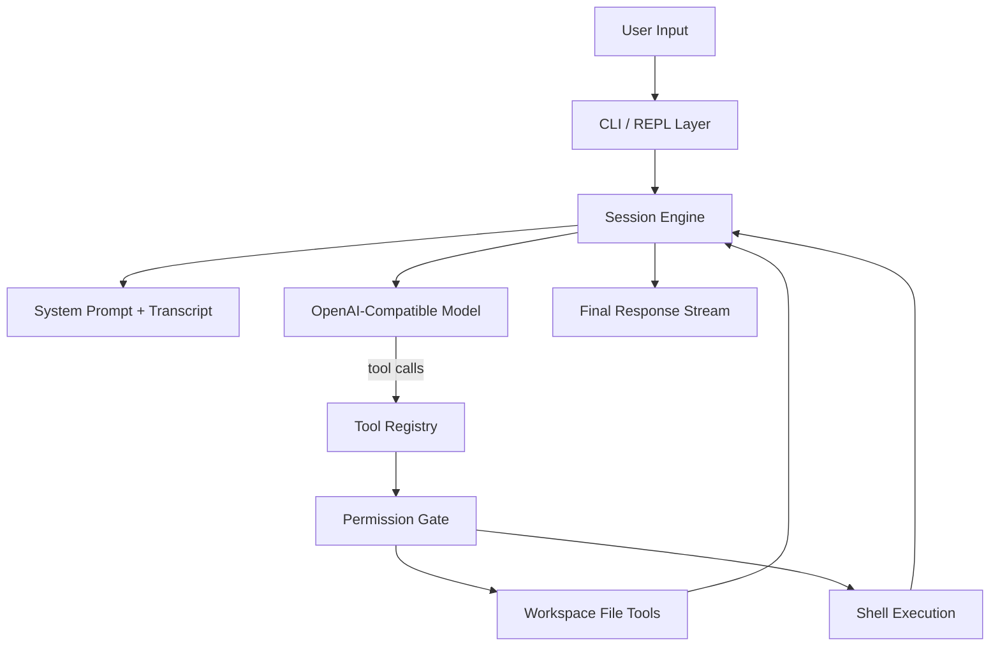

<p align="center">
  
</p>

<p align="center">
  <strong>A coding-agent harness for local development, built in Python.</strong>
  <br />
  claudecode-py packages an interactive REPL, a transcript-driven session engine, a typed tool runtime, and an explicit permission boundary into a compact Claude Code style CLI.
</p>

<p align="center">
  
  
  
  
  
</p>

## Overview

`claudecode-py` is a teaching-oriented coding agent that focuses on the core harness layers behind modern CLI agents:

- an interactive terminal entrypoint
- a message-driven query loop
- structured model tool calling
- a registry-based tool runtime
- human approval for side-effectful actions
- workspace-bounded file and shell execution

Rather than acting like a single script, the project is organized as a small agent runtime: user input enters a session engine, the engine delegates work through typed tools, tool results are fed back into the transcript, and the loop continues until the model reaches a final answer.

## Architecture Overview



The runtime is intentionally split into four layers:

- Entry layer: `claudecode chat` boots an interactive REPL and handles slash commands.
- Session layer: a persistent `SessionState` owns transcript history, system instructions, model calls, and the agent loop.
- Tool layer: each tool exposes a schema, description, mutability flag, and execution function through a common contract.
- Control layer: approval prompts, workspace path guards, and shell timeouts define the operational safety boundary.

## Execution Model

At the center of the project is a transcript-driven agent loop:

1. The user submits a prompt in the REPL.
2. The session appends that message to the conversation state.
3. The model receives the current transcript together with the registered tool schemas.
4. If the model emits tool calls, the runtime validates them, checks approvals when needed, executes the tools, and appends tool results back into the transcript.
5. The loop continues until the model returns a final natural-language answer.

This gives the project the same architectural shape as larger coding agents, while keeping the implementation readable enough to study end to end.

## Query Lifecycle

```text
user prompt
  -> session transcript
  -> model request with tool schemas
  -> tool call dispatch
  -> permission check
  -> tool execution
  -> tool_result appended
  -> next model turn
  -> final assistant response
```

From an agent-systems perspective, the important detail is that tools are not side utilities around the model. They are part of the model loop itself. The transcript is the shared working memory, and tool results become first-class context for the next inference step.

## Tool Runtime

The tool system is defined around a single reusable contract:

```python
ToolSpec(
    name=...,
    description=...,
    input_schema=...,
    read_only=...,
    run=...,
)
```

That contract makes the runtime legible from both sides:

- model-facing: each tool can be serialized into an OpenAI-compatible tool schema
- runtime-facing: each tool has a predictable execution path and result shape
- control-facing: the system can distinguish read-only operations from mutating operations before execution

Current built-in tools cover the essential coding-agent surface:

- `list_files`
- `read_file`
- `write_file`
- `replace_in_file`
- `run_shell`

## Permission and Safety Model

The harness treats permissions as part of the architecture, not as an afterthought.

- Read-only tools execute directly.
- Mutating tools require an explicit terminal confirmation.
- All file paths are resolved relative to the selected workspace root.
- Path traversal outside the workspace is rejected.
- Shell execution is non-interactive and timeout-bounded.

This gives the project a clear human-in-the-loop execution model: the model can propose actions, but the host runtime remains the authority for state-changing operations.

## Component Map

| Component | Responsibility |
| --- | --- |
| `src/claudecode/cli.py` | REPL entrypoint, slash commands, startup configuration |
| `src/claudecode/session.py` | conversation state, model calls, tool-call loop, transcript updates |
| `src/claudecode/tools.py` | workspace tools, shell runtime, path guards, tool registry |
| `src/claudecode/types.py` | shared runtime types for tools, results, and execution context |
| `tests/` | CLI validation, tool behavior, permission flow, and agent-loop tests |

## Demo v2

<p align="center">
  
</p>

```text
$ claudecode chat --cwd .
claudecode-py
Workspace: /path/to/project
Model: gpt-4.1-mini
Type /help for commands.

you> summarize this repository
tool list_files
tool read_file
assistant> ...
```

## Why This Design Works

The project is deliberately small, but the architecture scales conceptually:

- the REPL is separated from the query engine
- the query engine is separated from tool implementations
- the tool implementations are separated from permission policy
- the transcript is the single source of truth for model-visible state

That separation makes the codebase easy to extend toward richer agent features such as additional tools, alternate backends, stronger policy layers, or more advanced session orchestration.

## Installation

```bash
cd claudecode-py
python3 -m pip install -e .
```

Environment variables:

- `OPENAI_API_KEY`
- `OPENAI_BASE_URL`
- `OPENAI_MODEL`

Run:

```bash
claudecode chat --cwd /path/to/project
```

## Slash Commands

- `/help`
- `/tools`
- `/reset`
- `/exit`

## Verification

```bash
cd claudecode-py
PYTHONPATH=src python3.11 -m pytest
```

Current local test status: `9 passed`.
