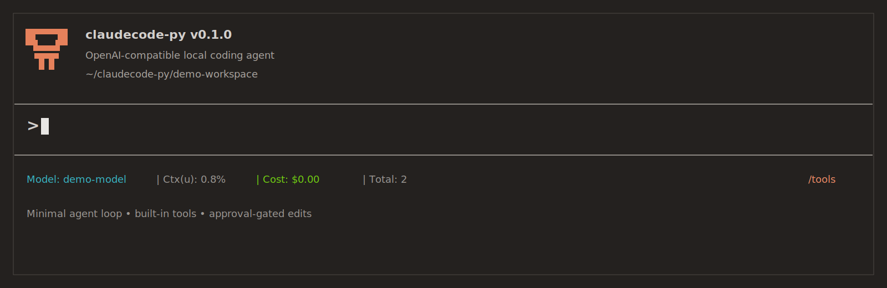
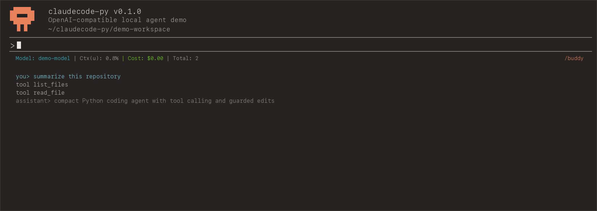
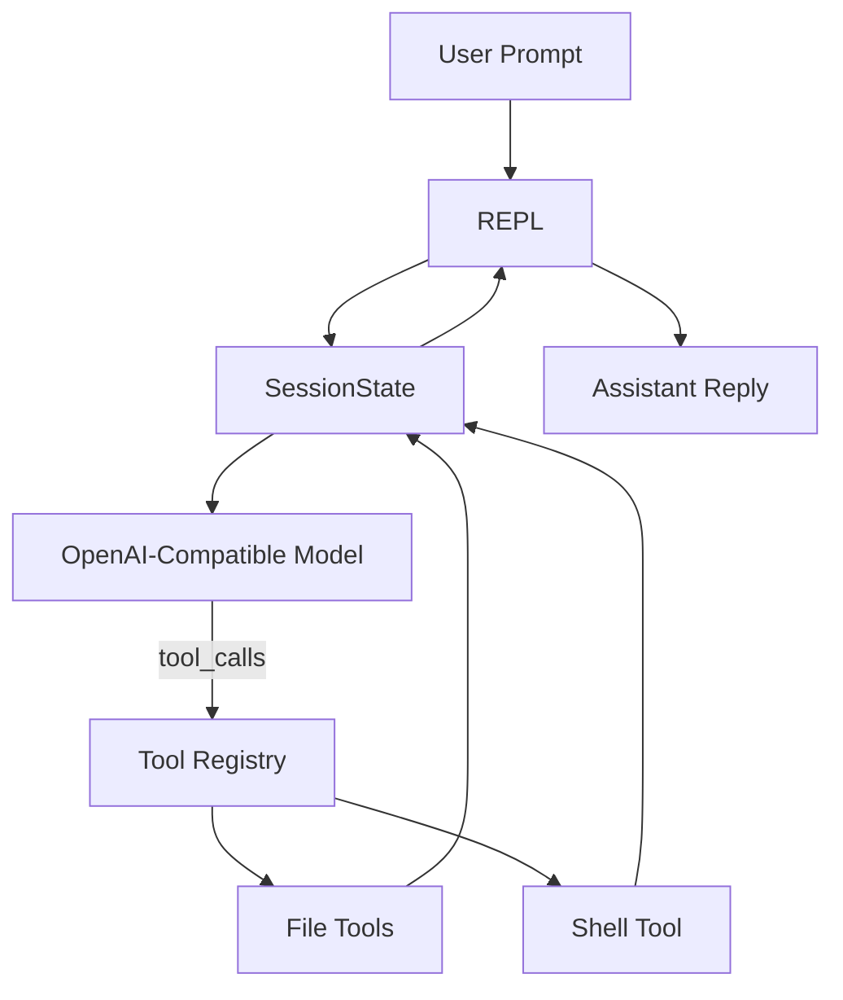

<p align="center">
  
</p>

<p align="center">
  <strong>A teaching-oriented Python coding agent CLI inspired by Claude Code.</strong>
  <br />
  Built with a minimal agent loop, tool dispatch, human approval gates, and an OpenAI-compatible backend.
</p>

<p align="center">
  
  
  
  
  
</p>

## Why This Repo Exists

`claudecode-py` is a compact coding-agent project for learning how modern CLI agents work without inheriting the complexity of a full production harness.

It focuses on the first layers that matter most:

- an interactive REPL
- a model-driven tool-calling loop
- a clean internal tool interface
- simple but explicit human approval for mutating actions
- safe workspace-bound file operations

If you want to understand the backbone behind tools like Claude Code, this repo is meant to be readable end to end.

## What It Can Do

- chat in an interactive terminal session
- list files inside a chosen workspace
- read UTF-8 text files with optional line ranges
- write complete file contents
- replace text inside existing files
- run short non-interactive shell commands
- require explicit approval before any write or shell action

## Demo v2

<p align="center">
  
</p>

```text
$ claudecode chat --cwd .
claudecode-py
Workspace: /path/to/project
Model: gpt-4.1-mini
Type /help for commands.

you> summarize this repository
assistant> I will inspect the workspace first.

tool list_files
tool read_file
assistant> This project is a teaching-oriented coding agent CLI with...
```

## Architecture



The repo intentionally keeps the harness small:

- `cli.py` handles the REPL and slash commands
- `session.py` owns the agent loop and tool-call round trips
- `tools.py` provides the built-in workspace tools
- `types.py` defines the shared tool and session data structures

## Quick Start

```bash
cd claudecode-py
python3 -m pip install -e .
```

Set your environment:

```bash
export OPENAI_API_KEY="your-key"
export OPENAI_MODEL="gpt-4.1-mini"
# optional
export OPENAI_BASE_URL="https://api.openai.com/v1"
```

Run the CLI:

```bash
claudecode chat --cwd /path/to/project
```

## Slash Commands

- `/help`
- `/tools`
- `/reset`
- `/exit`

## Safety Model

This prototype keeps safety simple and visible:

- read-only tools run automatically
- `write_file`, `replace_in_file`, and `run_shell` require terminal confirmation
- all file paths are sandboxed to the selected workspace root
- shell commands are non-interactive and timeout-bounded

## Project Layout

```text
claudecode-py/
├── src/claudecode/
│   ├── cli.py
│   ├── session.py
│   ├── tools.py
│   └── types.py
├── tests/
└── README.md
```

## What This Demonstrates

This repo is useful as a portfolio project because it shows:

- LLM tool-calling orchestration
- CLI product thinking
- file-system safety boundaries
- testable agent-loop design
- clean separation between UI, orchestration, and tool execution

## Development

```bash
cd claudecode-py
PYTHONPATH=src python3.11 -m pytest
```

Current local test status: `9 passed`.
